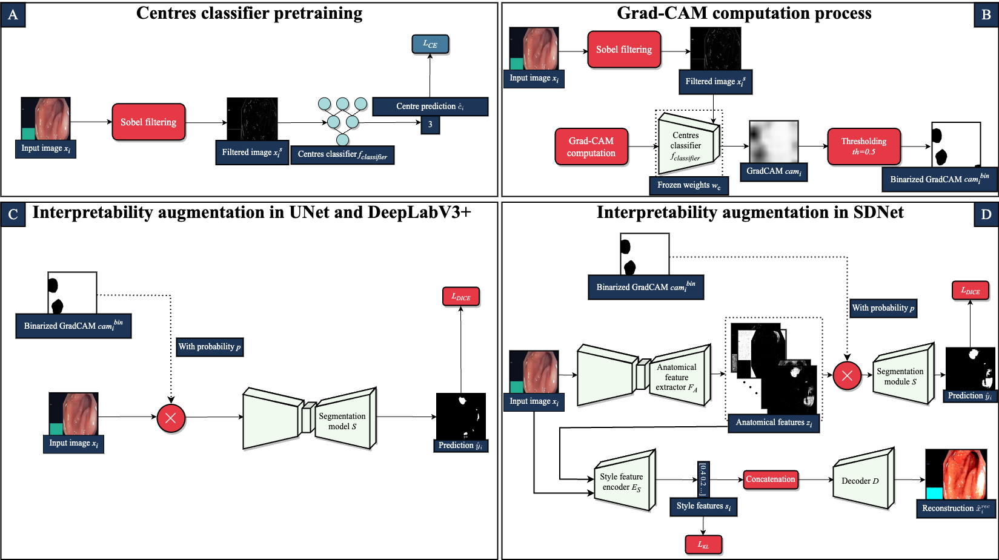

# Interpretability-guided Data Augmentation

This repository contains the code of the paper **Interpretability-guided Data Augmentation for Robust Segmentation in Multi-centre Colonoscopy Data**, accepted at the [MLMI workshop at MICCAI 2023](https://sites.google.com/view/mlmi2023).

### Graphical Abstract



### Requirements

All experiments were carried out using the following:

* albumentations==1.3.0
* captum==0.6.0
* kornia==0.6.12
* lightning==2.0.0
* monai==1.1.0
* numpy==1.23.0
* pandas==1.4.3
* psutil==5.9.4
* scikit-image==0.19.2
* scikit-learn==1.1.1
* torch==1.13.1
* torchmetrics==0.11.4
* torchvision==0.14.1
* wandb==0.13.9

### Dataset
All experiments were conducted on the open-source PolypGen dataset. You can ask for access to the dataset at this [link](https://www.synapse.org/#!Synapse:syn26376615/wiki/613312).

### Training

To launch the training of one of the available models run the following:

```
python /projects/shift_review/sdnet_miccai/train.py \
    --num-workers [NUM_WORKERS] \
    --max-epochs [MAX_EPOCHS] \
    --model-name [MODEL_NAME] \
    --classifier-ckpt-path [PATH_TO_CLAFFIER_CHECKPOINT] \
    --csv-file-name [NAME_OF_CSV_DATASET_SPLIT] \
    --save-path [PATH_TO_FOLDER_OF_RESULTS] \
    --csv-saliency [PATH_TO_CSV_WITH_PREGENERATED_GRADCAM] \
    --wandb-name [W&B_RUN_NAME] \
    --project-name [W&B_PROJECT_NAME]
```
### Testing

To launch only the testing of one of the available models run the following: 

```
python /projects/shift_review/sdnet_miccai/test.py \
    --num-workers [NUM_WORKERS] \
    --model-name [MODEL_NAME] \
    --csv-file-name [NAME_OF_CSV_DATASET_SPLIT] \
    --save-path [PATH_TO_FOLDER_OF_RESULTS] \
    --classifier-ckpt-path [PATH_TO_CLAFFIER_CHECKPOINT] \
    --ckpt-path [PATH_TO_CHECKPOINT_TO_TEST] \
    --csv-saliency [PATH_TO_CSV_WITH_PREGENERATED_GRADCAM] \
    --wandb-name [W&B_RUN_NAME] \
    --project-name [W&B_PROJECT_NAME]
   ```

### To-do

* Use [Hydra](https://hydra.cc/) to handle configurations instead of command line arguments
* Remove artifact creation in W&B logging

### Aknowledgments

* Thanks to [spthermo](https://github.com/spthermo/SDNet/tree/master) for the original Pytorch implementation of [SDNet](https://www.sciencedirect.com/science/article/abs/pii/S1361841519300684).
* Thanks to [sharib-vision](https://github.com/sharib-vision/PolypGen-Benchmark) for the original Pytorch implementations of UNet and DeepLabV3+.
* Thanks to [DebeshJha](https://github.com/DebeshJha/PolypGen) for the original dataset repository. 
